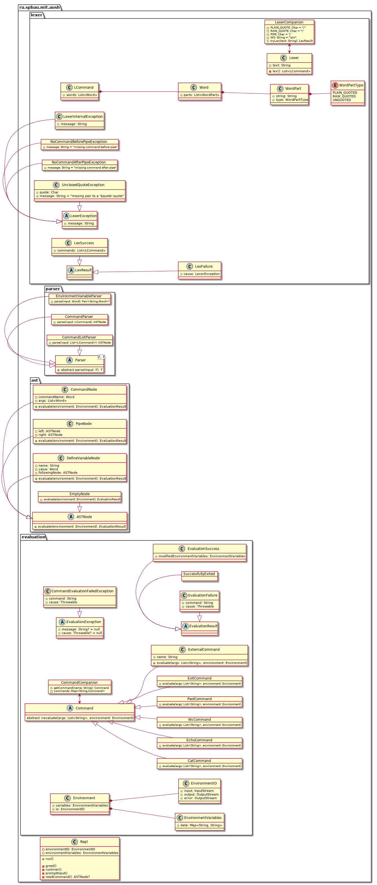

# HW01 AUsh

[link](https://drive.google.com/file/d/1LYqicbk4jpZkcSCKSO9X19_2WGDzNRbY/view)

## Simple Bash-like shell which supports

- single and double quoted text
- environment variables
- string interpolation using `$` operator
- pipelines using `|` operator

### Architectural notes



Shell reads lines until Lexer can lex accumulated input.

Simple grammar for lexer:

```
input = _ | (command "|")* command
command = environmentVariable* (name arguments)?
environmentVariable = identifier"="word
name = word
arguments = (word)*
identifier = [_A-Za-z][_0-9A-Za-z]*
word = [^\s\n]+
```

After lexing lexems are passed to parser which builds AST. AST is then evaluated.

#### Commands

Represented by class `Command` which has method `evaluate(args, environment)`.

Its subclasses are built-in commands and `ExternalCommand(name)` used to run unknown commands from outer shell

#### AST

Represented by `ASTNode`s which have method `evaluate(environment)`. Its subclasses:

- `CommandNode(command, args) => command args`
- `PipeNode(l, r) => l | r`
- `DefineVariableNode(name, value, next) => name=value next`
- `EmptyNode => _no-op_` -- needed in case the command entirely consists of environment variable assignments

# HW02 AUsh::grep

[link](https://drive.google.com/file/d/1X8DBiR8vheVlIVjH39UGuuxtHX3VU8s8/view)

## grep command implementation over AUsh

- command line argument parsing (just `-i`, `-w`, `-A n`)
- regex search

### CLI argument parse library

I chose xenomachina/kotlin-argparser, [because ...](GrepArgparseLibraryChoiceExplained.md)

# HW04 AUsh::cd&ls

## cd command implementation over AUsh

- changes directory
- 0 or 1 argument

## ls command implementation over AUsh

- support of multiple arguments
- both files and directories
